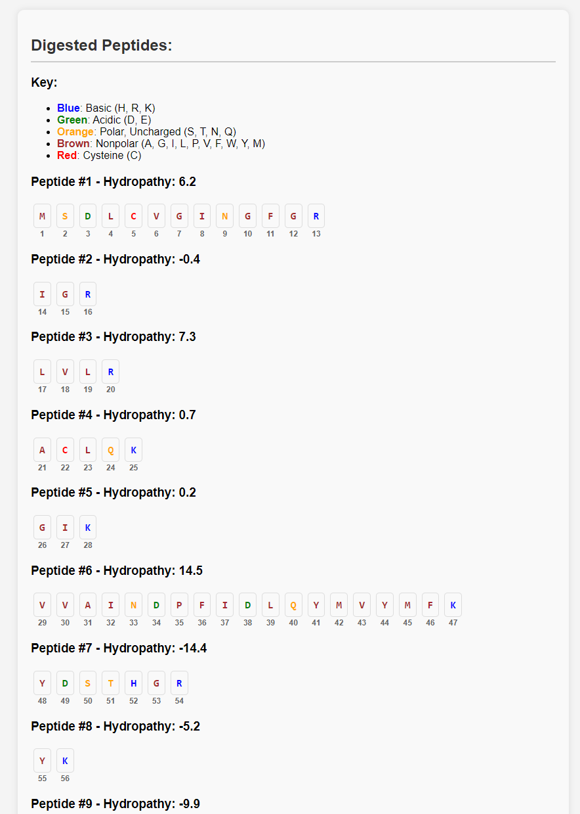

# Input a protein sequence and pick an enzyme to in-silico digest it!
This repository provides code for _in-silico_ digesting protein sequences and includes hydrophobicity of resulting peptides. Score are generated using summed Kyte-Doolittle values.

Visit the app (hosted on AWS)

http://44.204.185.233/digest

