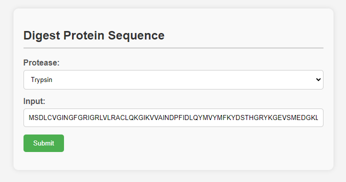

# Submit a protein sequence and pick an enzyme to digest it!
This repository provides code for _in-silico_ digesting protein sequences and includes hydrophobicity of resulting peptides. Scores are generated using summed Kyte-Doolittle values.

Enzyme choices: 
- None 
- Trypsin 
- Chymotrypsin 
- Lyc-C 
- Arg-C 
- Glu-C 
- AspN

Visit the app (hosted on AWS)

